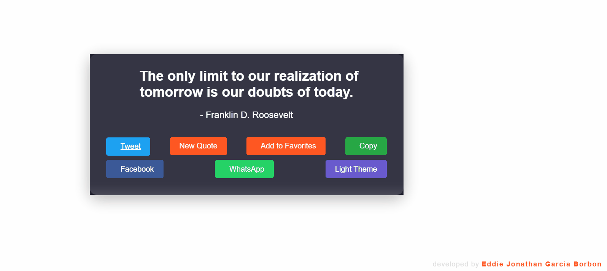

# 🌟 Random Quote Generator 🌟

Welcome to the Random Quote Generator! This is a simple yet powerful React application that provides you with inspiring quotes, allows you to save your favorites, and even share them on social media. 🚀  

---

## 🎥 Demo  
  

---

## 🌈 Features  
- 💬 **Random Quotes**: Get a new inspiring quote every time you click the "New Quote" button.  
- ❤️ **Favorite Quotes**: Save your favorite quotes to a list for later reference.  
- 📋 **Copy to Clipboard**: Easily copy quotes to your clipboard with one click.  
- 🌙 **Dark Mode**: Toggle between light and dark themes for a comfortable reading experience.  
- 🎵 **Sound Effects**: Enjoy sound effects for actions like adding to favorites, copying, and more.  
- 📱 **Share on Social Media**: Share quotes directly on Twitter, Facebook, and WhatsApp.  

---

## 🛠️ Technologies Used  
- **React**: A JavaScript library for building user interfaces.  
- **LocalStorage**: For saving favorite quotes and theme preferences.  
- **FontAwesome**: For beautiful icons.  
- **CSS**: For styling and animations.  

---

## 🚀 How to Run the Project  

1. Clone the repository:  
   bash
   git clone https://github.com/your-username/random-quote-generator.git

2. Navigate to the project folder:
  cd random-quote-generator

3. Install dependencies:
  npm install

4. Run the application:
  npm start
  
5. Open your browser:
Go to http://localhost:3000 to see the app in action.

##🤝 Contributing
Contributions are always welcome! 😊 If you have any ideas, suggestions, or bug reports, feel free to open an issue or submit a pull request.

##📝 License
This project is licensed under the MIT License. See the LICENSE file for more details.

📧 Contact
If you have any questions or just want to say hi, feel free to reach out:

Made by Eddie Jonathan Garcia Borbon 🚀
